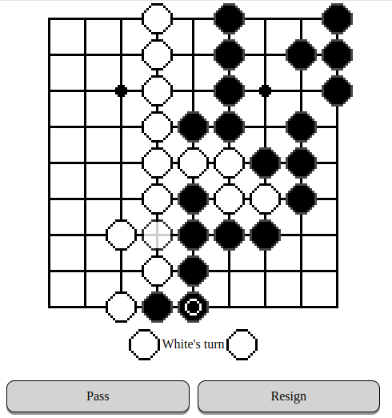

[Go](https://en.wikipedia.org/wiki/Go_(game)) (囲碁 / いご), weiqi (围棋), paduk (바둑) is a classical board game, popular in east Asia and increasingly elsewhere.

There are a number of ways to play free online, but most need registration. I made a little board so you can play without an account.

You can [try the demo](https://za3k.github.io/go). The board works well, but there's no online play.

Credits:
- "newspaper" style board original
- Clack sounds stolen without permission from online-go.com. They are just recorded clack sounds of real stones.
